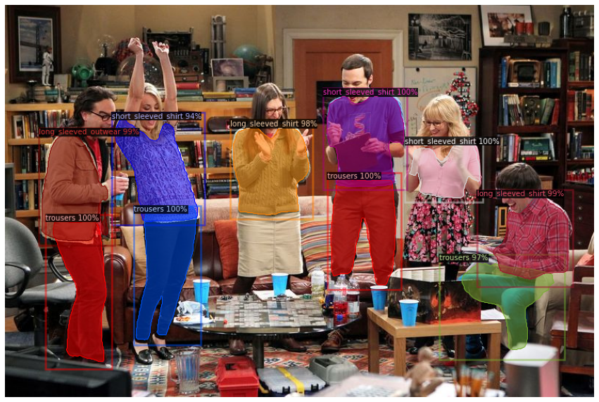

# clothing-detection-segmentation-using-detectron2
cutomizing mask rcnn backboned with FPN + Resnet50 from detecton2 model zoo on deep fashion2 dataset
<!--
-->

<!---->

## 1. Dataset 
the model was trained on 50k images extracted from [DeepFashion2](https://github.com/switchablenorms/DeepFashion2)
